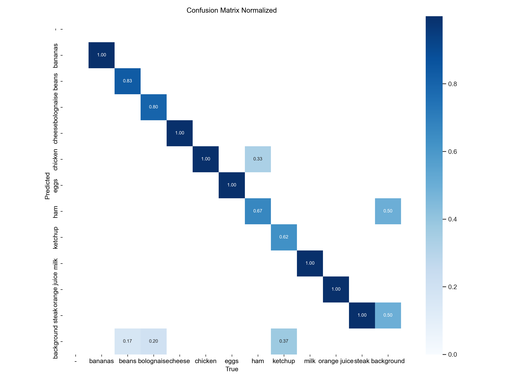
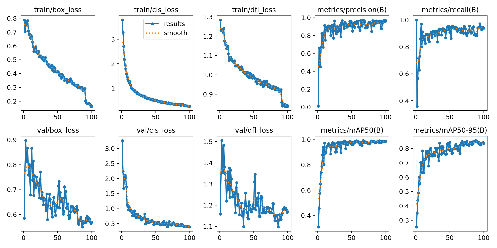
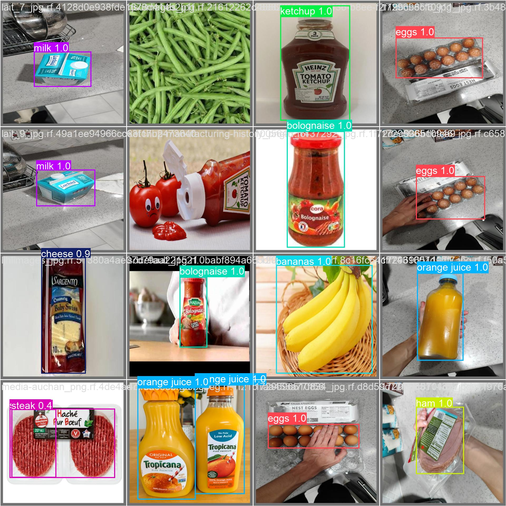

# Smart Fridge (**WIP**)

This project involves developing a smart fridge that tracks the items stored inside and suggests recipes based on the available ingredients.

## Getting Started

Clone the project on your machine

```
git clone https://github.com/Alfred0404/Smart_Fridge_Project_Code.git
```

### Prerequisites

You need [Python &gt;3.11](https://www.python.org/downloads/) and some dependencies:

- [Flask](https://flask.palletsprojects.com/en/3.0.x/)
- [Ollama](https://github.com/ollama/ollama-python)
- [OpenCV](https://vovkos.github.io/doxyrest-showcase/opencv/sphinx_rtd_theme/index.html#)
- [Ultralytics](https://docs.ultralytics.com/quickstart/#install-ultralytics)
- [EasyOCR](https://pypi.org/project/easyocr/)

```
pip install opencv-python ollama Flask ultralytics easyocr
```

## Training

The model was trained using a [custom dataset](https://app.roboflow.com/fridgeinventorydetection/fridge_inventory_detection/1). Images come from our personnal fridge, and Google Image.
Every image has been labeled by hand.


Here's some stats about the model so far:

<figure style="text-align: left;">
  <p style="font-family: arial; margin: 0;">Confusion matrix normalized</p>
  
</figure>

<figure style="text-align: left;">
  <p style="font-family: arial; margin: 0;">Global metrics</p>
  
</figure>

<figure style="text-align: left;">
  <p style="font-family: arial; margin: 0;">Predictions on validation data</p>
  
</figure>

It's only a first training test, which is very conclusive and reinforces the idea of continuing along this path.
There is still a lot to do.

### Cuda

Cuda has accelerated the learning process, enabling tensorflow to use the Nvidia GPU to compute the learning data.
* Install dependencies by generating your command [here](https://pytorch.org/get-started/locally/), you should get something like that:
  `pip3 install torch torchvision torchaudio --index-url https://download.pytorch.org/whl/cu118`
* Check if cuda is properly downloaded
  ```python
  >>> import torch
  >>> torch.cuda.is_available()
  True
  ```
* If you're struggling, this [stackoverflow discussion](https://stackoverflow.com/questions/57814535/assertionerror-torch-not-compiled-with-cuda-enabled-in-spite-upgrading-to-cud) helped get it to work.

## Authors

- **Alfred de Vulpian** - [Alfred0404](https://github.com/Alfred0404)
- **Clément d'Alberto** - [Clement-dl](https://github.com/https://github.com/Clement-dl)
- **Alara Tanguy** - [AlTang01](https://github.com/AlTang01)

See the list of [contributors](https://github.com/Alfred0404/Smart_Fridge_Project_Code/contributors) who participated in this project.


# References

Jocher, G., & Qiu, J. (2024). Ultralytics YOLO11 (11.0.0) [Computer software]. https://github.com/ultralytics/ultralytics.

Kuznetsova, A., Rom, H., Alldrin, N., Uijlings, J., Krasin, I., Pont-Tuset, J., Kamali, S., Popov, S., Malloci, M., Kolesnikov, A., Duerig, T., & Ferrari, V. (2020). The Open Images Dataset V4: Unified image classification, object detection, and visual relationship detection at scale. IJCV.